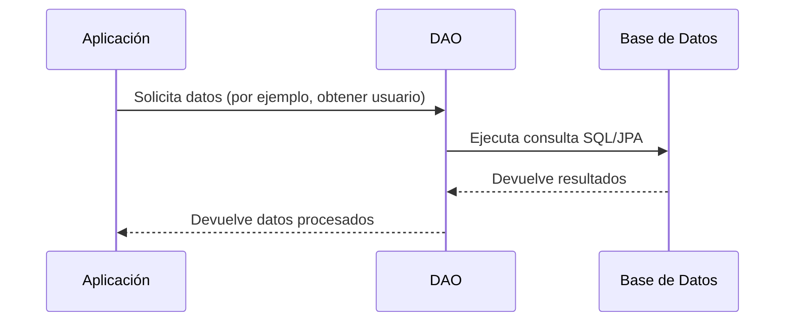

# DAO (Data Access Object)

## ¿Qué es DAO?
El patrón DAO (Data Access Object) es un patrón de diseño estructural que proporciona una abstracción para acceder y manipular datos de una fuente de datos (por ejemplo, una base de datos). El DAO encapsula toda la lógica de acceso a datos, separando esta responsabilidad de la lógica de negocio de la aplicación.

## ¿Qué función cumple?
El DAO actúa como intermediario entre la aplicación y la fuente de datos. Su función principal es proporcionar una interfaz para realizar operaciones CRUD (Crear, Leer, Actualizar, Eliminar) sobre los datos, ocultando los detalles de implementación y acceso a la base de datos.

## Casos de uso
- Aplicaciones empresariales que requieren separar la lógica de negocio del acceso a datos.
- Proyectos donde se desea facilitar el mantenimiento y la escalabilidad del código.
- Sistemas que pueden cambiar de motor de base de datos en el futuro.
- Aplicaciones que requieren pruebas unitarias, permitiendo el uso de DAOs simulados (mocks).

## Ventajas
- **Separación de responsabilidades:** La lógica de acceso a datos se separa de la lógica de negocio.
- **Facilita el mantenimiento:** Cambios en la fuente de datos no afectan la lógica de negocio.
- **Reutilización:** Los DAOs pueden ser reutilizados por diferentes partes de la aplicación.
- **Testabilidad:** Permite el uso de mocks para pruebas unitarias.

## Desventajas
- **Sobrecarga de código:** Puede aumentar la cantidad de clases y código en proyectos pequeños.
- **Complejidad:** Añade una capa adicional que puede ser innecesaria en aplicaciones simples.

## Diagrama de comunicación

## Métodos comunes en un DAO
- `findById(id)`: Buscar un registro por su identificador.
- `findAll()`: Obtener todos los registros.
- `save(entity)`: Guardar o actualizar un registro.
- `deleteById(id)`: Eliminar un registro por su identificador.
- `update(entity)`: Actualizar un registro existente.

> **Comentario:** En aplicaciones Java con Spring Boot e Hibernate/JPA, los DAOs suelen implementarse como interfaces o clases que extienden `JpaRepository` o utilizan el `EntityManager` para interactuar con la base de datos.

